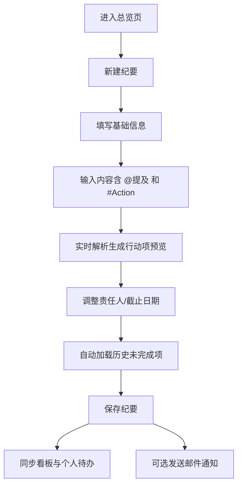
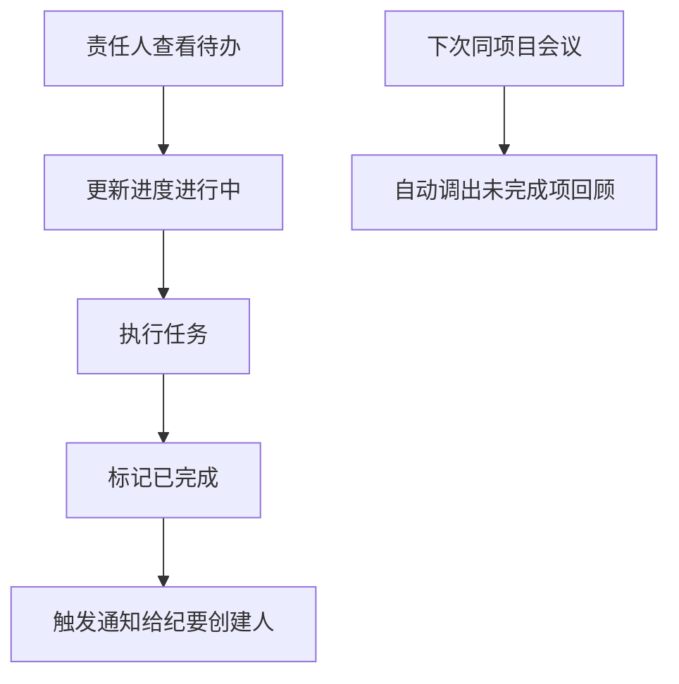

## 1. 产品概述

一款面向团队协作的会议纪要与行动项追踪工具，解决会议后决策落地难、待办遗漏、责任模糊的问题。通过结构化纪要生成、@提及分派行动项、看板进度追踪、自动回顾等能力，实现从会议决策到落地执行的全链路闭环。

- 核心用户：项目经理、会议主持人、团队成员、项目干系人
- 市场价值：将会议成果转化为可追踪的执行单元，显著提升团队决策落地率，减少跨部门协作损耗

## 2. 核心功能

### 2.1 用户角色

| 角色 | 注册方式 | 核心权限 |
|------|----------|----------|
| 纪要创建人 | 内置账户 | 创建/编辑/删除纪要、分派行动项、发送邮件、接收完成通知 |
| 责任人 | 内置账户 | 查看个人待办、更新行动项进度、标记完成 |
| 参会人 | 内置账户 | 查看纪要内容、查阅相关行动项、搜索历史记录 |

### 2.2 功能模块

1. **会议总览页**：纪要列表、项目/参会人过滤器、全文搜索框、新建纪要入口、快捷统计卡片
2. **纪要编辑页**：主题、参会人选择、讨论要点富文本、决策结论、@提及解析、Action 标签识别、行动项截止日期设置、行动项预览列表、关联历史未完成项
3. **行动项看板页**：三栏看板（未开始/进行中/已完成）、责任人筛选、进度拖拽、逾期高亮、完成通知触发
4. **纪要详情页**：纪要内容渲染、行动项列表、关联历史决策、发送邮件按钮
5. **全局搜索页**：全文搜索结果、按项目/参会人/时间多维度过滤、高亮匹配片段

### 2.3 页面详情

| 页面名称 | 模块名称 | 功能描述 |
|----------|----------|----------|
| 会议总览页 | 顶部导航栏 | Logo、页面切换（总览/看板/搜索）、用户头像下拉 |
| 会议总览页 | 统计卡片 | 纪要总数、待办行动项数、本周完成率、逾期项数 |
| 会议总览页 | 过滤栏 | 项目下拉、参会人多选、日期范围、关键词搜索 |
| 会议总览页 | 纪要列表 | 卡片式列表，显示主题、项目、日期、参会人头像、行动项进度条 |
| 纪要编辑页 | 基础信息 | 主题输入、项目选择、会议日期、参会人多选（带头像） |
| 纪要编辑页 | 内容编辑器 | 讨论要点和决策结论区域，支持 @提及 自动弹出用户列表、#Action 标签高亮 |
| 纪要编辑页 | 行动项生成预览 | 解析文本自动生成待办，可调整责任人、截止日期、描述 |
| 纪要编辑页 | 历史回顾区 | 自动加载同项目上次会议未完成项，可勾选纳入本次纪要 |
| 行动项看板页 | 看板三列 | 未开始/进行中/已完成，卡片可拖拽切换状态 |
| 行动项看板页 | 卡片内容 | 行动项标题、责任人头像、截止日期（逾期标红）、关联纪要链接、进度更新按钮 |
| 行动项看板页 | 过滤控制 | 责任人筛选、项目筛选、仅看我的开关 |
| 纪要详情页 | 内容展示 | 富文本渲染、@提及高亮、行动项标签色块 |
| 纪要详情页 | 行动项列表 | 可折叠行动项列表、进度切换、一键发送邮件 |
| 全局搜索页 | 搜索框 | 支持全文关键词、回车触发搜索 |
| 全局搜索页 | 过滤面板 | 项目多选、参会人多选、时间范围、排序方式 |
| 全局搜索页 | 结果列表 | 标题、匹配片段高亮、元信息（日期/项目/参会人） |

## 3. 核心流程

### 3.1 纪要创建与行动项分派

用户进入总览页 → 点击「新建纪要」 → 填写主题、项目、参会人 → 在讨论要点/决策结论中输入内容（如「@张三 #Action 完成方案设计，截止 6/30」） → 系统实时解析并在右侧预览行动项 → 可手动调整每个行动项的责任人/截止日期 → 系统自动加载同项目上次未完成项供勾选 → 保存纪要 → 行动项同步进入看板与个人待办 → 可点击发送邮件给所有参会人（内嵌各人待办清单）

### 3.2 行动项执行与闭环

责任人登录 → 进入看板页或查看「仅看我的」 → 点击行动项卡片更新进度（未开始→进行中→已完成） → 标记「已完成」时自动触发通知 → 纪要创建人收到站内通知/邮件 → 下次同项目会议时自动作为回顾项调出

### 3.3 历史决策检索

用户进入搜索页或总览搜索框 → 输入关键词 → 可叠加项目/参会人/时间过滤 → 查看匹配结果，高亮片段 → 跳转纪要详情 → 查看上下文决策与关联行动项

## 4. 用户界面设计

### 4.1 设计风格

- **主色调**：深海蓝 `#1e3a5f`（权威与专业感）+ 琥珀橙 `#f59e0b`（行动与警示）作为双主色
- **辅助色**：薄荷绿 `#10b981`（完成）、赤红 `#ef4444`（逾期）、柔紫 `#8b5cf6`（标签）
- **中性色**：石板灰系 `#f8fafc / #f1f5f9 / #cbd5e1 / #334155 / #0f172a`
- **按钮样式**：胶囊型大圆角（`rounded-full`），主按钮深海蓝填充配白字，悬停上浮阴影；次按钮描边
- **字体选择**：标题用「思源黑体 Bold」/「PingFang SC Semibold」展示层级；正文用「Inter / 苹方」保证中文可读性；行动项看板卡片标题加粗配项目标签
- **布局风格**：卡片式布局，充足留白（p-6 起步），柔和阴影（`shadow-sm hover:shadow-md`），栅格打破：看板页三列不等宽（进行中略宽），总览页左侧宽列表 + 右侧统计侧栏
- **图标风格**：统一使用 lucide-react 线性图标，尺寸 18-20px，与文字基线对齐
- **背景与质感**：整体浅灰底 `#f8fafc`，卡片纯白配 1px 浅边；顶部导航深海蓝渐变至 `#2c5282`；按钮与标签用微光渐变

### 4.2 页面设计概述

| 页面名称 | 模块名称 | UI 元素 |
|----------|----------|----------|
| 会议总览页 | 顶部导航 | 深海蓝渐变背景，左侧 Logo+标题，右侧三个主导航 Tab（带下划线动画），最右侧用户头像圆卡 |
| 会议总览页 | 统计区 | 四张并排卡片，每张含图标（灰蓝圆形底）、大号数字（琥珀橙强调）、副标题、较上周变化小徽标 |
| 会议总览页 | 过滤栏 | 一行四列：项目下拉、参会人多选（标签式）、日期范围、搜索框（左侧放大镜图标），右端新建按钮（琥珀橙渐变，胶囊型） |
| 会议总览页 | 纪要列表 | 垂直卡片列表，左侧主题大号字+项目小圆标签，中部参会人头像堆叠，右侧行动项进度条（三段式颜色）+ 操作按钮组 |
| 纪要编辑页 | 双栏布局 | 左 7：基础信息 + 内容编辑器；右 3：行动项预览（粘性定位）+ 历史回顾区 |
| 纪要编辑页 | 内容编辑器 | 讨论要点与决策结论分区，富文本工具栏（加粗/列表/引用），@和#输入时弹出自定义建议浮层，选中后高亮色块包裹 |
| 纪要编辑页 | 行动项卡片 | 白底浅边，左侧责任人头像，中间标题（可编辑）+ 截止日期选择器，右侧状态徽标+删除按钮 |
| 行动项看板页 | 三列看板 | 每列顶部标题+计数徽标（未开始灰、进行中琥珀、已完成薄荷），卡片拖拽时阴影加深+边框琥珀色 |
| 行动项看板页 | 行动项卡片 | 顶部项目标签色块，中部标题与描述，底部责任人头像+截止日期（逾期打红×叹号图标），右小角进度切换菜单 |
| 全局搜索页 | 过滤面板 | 左侧固定宽侧栏（折叠式分组）：项目多选复选框、参会人（带头像）、时间快捷选项（本周/本月/本季）、高级开关 |
| 全局搜索页 | 结果列表 | 类 Google 结果：标题深蓝下划线可点，URL 式面包屑（项目 > 日期），描述中关键词高亮（琥珀色背景） |

### 4.3 响应式

- **桌面优先**：默认针对 1440px 宽度设计，内容区最大 1400px 居中
- **平板断点 1024px**：总览页统计卡片改为 2×2 栅格；纪要编辑页双栏改为上下堆叠；看板改为横向可滚动
- **移动端断点 640px**：顶部导航 Tab 改为底部 Dock；过滤栏折叠为抽屉；看板卡片纵向堆叠单栏列表

### 4.4 微交互与动效

- 页面加载：统计卡片数字从 0 滚动至目标值（200ms 缓动）
- 拖拽：卡片拿起时轻微上浮 + 琥珀描边，放下后位置柔化过渡
- @提及输入：输入 @ 时建议列表淡入 + 轻微向上浮现，选中项文字块从光标位置展开高亮
- 行动项标记完成：卡片滑入「已完成」列时伴随轻微缩放 + 勾选图标淡入画勾
- 按钮悬停：主按钮阴影扩散 + 背景色微变（150ms cubic-bezier）
