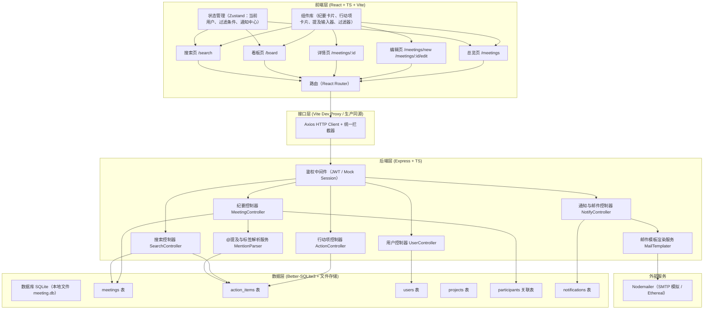
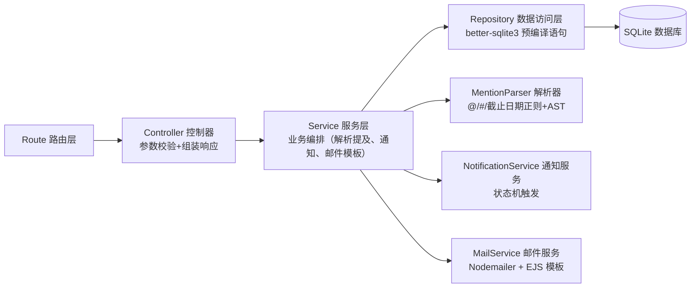
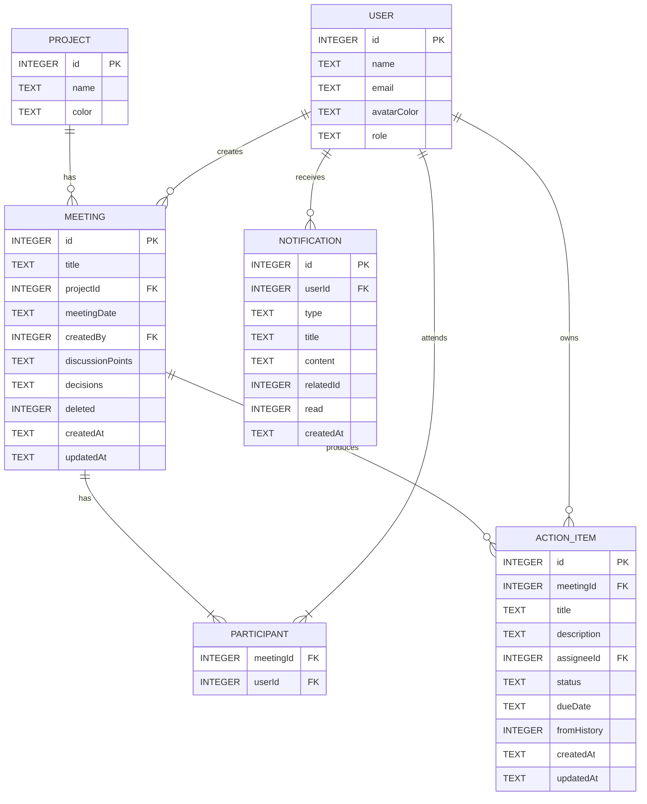

## 1. 架构设计



## 2. 技术说明

- **前端**：React 18 + TypeScript + Vite 5 + React Router 6 + Tailwind CSS 3 + Zustand 4 + lucide-react + @dnd-kit/core（看板拖拽）
- **初始化工具**：`vite-init`（`react-express-ts` 模板）
- **后端**：Express 4 + TypeScript（ESM）+ better-sqlite3 + Nodemailer
- **数据库**：SQLite（本地嵌入式，便于单机演示与零配置）
- **状态管理**：
  - 前端：Zustand 管理全局会话（当前用户、过滤条件、未读通知数）
  - 服务端：better-sqlite3 同步 ORM 风格操作
- **Mock 数据**：首次启动自动建表并插入 5 个用户、3 个项目、8 份纪要、20+ 行动项示例数据

## 3. 路由定义

### 前端路由 (React Router)

| 路由 | 用途 |
|------|------|
| `/` | 重定向至 `/meetings` |
| `/meetings` | 会议总览页（纪要列表 + 过滤 + 统计） |
| `/meetings/new` | 新建纪要页 |
| `/meetings/:id` | 纪要详情页 |
| `/meetings/:id/edit` | 编辑纪要页 |
| `/board` | 行动项看板页 |
| `/search` | 全局搜索页 |

### 后端 API 路由 (Express, `/api` 前缀)

| 方法 | 路径 | 用途 |
|------|------|------|
| GET | `/api/meetings` | 获取纪要列表（支持 projectId, participantId, keyword, dateRange 查询） |
| GET | `/api/meetings/:id` | 获取单份纪要详情（含参会人、行动项、历史关联项） |
| POST | `/api/meetings` | 创建纪要（自动解析行动项 + 同步历史项） |
| PUT | `/api/meetings/:id` | 更新纪要（重新解析行动项） |
| DELETE | `/api/meetings/:id` | 删除纪要（软删除） |
| GET | `/api/meetings/:id/unfinished-siblings` | 同项目上次会议未完成行动项（用于编辑页回顾区） |
| GET | `/api/actions` | 获取行动项列表（看板，支持 assigneeId / projectId / status） |
| PATCH | `/api/actions/:id` | 更新行动项（状态/截止日期/责任人；状态变更为完成时触发通知） |
| GET | `/api/users` | 获取用户列表（用于参会人/责任人选择器） |
| GET | `/api/users/:id/todos` | 获取某用户的个人待办列表 |
| GET | `/api/projects` | 获取项目列表 |
| GET | `/api/search` | 全文搜索（标题、讨论要点、决策结论、行动项标题），返回高亮片段 |
| POST | `/api/meetings/:id/send-email` | 发送纪要邮件（按参会人分送，内嵌该人待办清单） |
| GET | `/api/notifications` | 获取当前用户通知列表 |
| PATCH | `/api/notifications/:id/read` | 标记通知已读 |

## 4. API 类型定义 (TypeScript)

```typescript
// ---------- 共享实体 ----------
export interface User {
  id: number;
  name: string;
  email: string;
  avatarColor: string; // tailwind color class, e.g. 'bg-amber-500'
  role: 'admin' | 'member';
}

export interface Project {
  id: number;
  name: string;
  color: string; // tag color
}

export type ActionStatus = 'todo' | 'doing' | 'done';

export interface ActionItem {
  id: number;
  meetingId: number;
  title: string;
  description?: string;
  assigneeId: number;
  assignee?: User;
  status: ActionStatus;
  dueDate?: string; // ISO date
  overdue?: boolean;
  createdAt: string;
  updatedAt: string;
  fromHistory?: boolean; // 是否来自上次会议遗留
}

export interface Meeting {
  id: number;
  title: string;
  projectId: number;
  project?: Project;
  meetingDate: string; // ISO date
  createdBy: number;
  creator?: User;
  discussionPoints: string; // 富文本（含 @/# 标记）
  decisions: string; // 富文本
  participantIds: number[];
  participants?: User[];
  actionItems?: ActionItem[];
  createdAt: string;
  updatedAt: string;
  deleted: 0 | 1;
}

export interface Notification {
  id: number;
  userId: number;
  type: 'action_done' | 'meeting_created' | 'email_sent';
  title: string;
  content?: string;
  relatedId?: number;
  read: 0 | 1;
  createdAt: string;
}

// ---------- 请求 / 响应 ----------
export interface CreateMeetingRequest {
  title: string;
  projectId: number;
  meetingDate: string;
  participantIds: number[];
  discussionPoints: string;
  decisions: string;
  includeActionIds?: number[]; // 纳入的历史遗留行动项 ID
  actionOverrides?: Array<{
    tempKey?: string;
    title: string;
    assigneeId: number;
    dueDate?: string;
    status?: ActionStatus;
  }>;
}

export interface UpdateActionRequest {
  status?: ActionStatus;
  assigneeId?: number;
  dueDate?: string;
  title?: string;
}

export interface SearchResponse {
  meetings: Array<{
    id: number;
    title: string;
    projectName: string;
    meetingDate: string;
    highlights: Array<{ field: string; snippet: string }>;
    matchedParticipants: User[];
  }>;
  actions: Array<{
    id: number;
    title: string;
    meetingTitle: string;
    snippet: string;
    status: ActionStatus;
  }>;
}

export interface EmailSendRequest {
  ccCreator?: boolean;
  customNote?: string;
}
```

## 5. 服务端架构分层



- **路由层** (`api/routes/*.ts`)：定义 RESTful 路径、调用 Controller，统一错误处理
- **控制层** (`api/controllers/*.ts`)：请求体校验（zod）、调用 Service、包装 HTTP 响应
- **服务层** (`api/services/*.ts`)：核心业务逻辑；MentionParser 负责从富文本提取 `@用户 #Action 描述 截止 YYYY-MM-DD`；NotificationService 监听行动项完成事件；MailService 渲染 EJS 模板并调用 Nodemailer
- **数据访问层** (`api/repositories/*.ts`)：封装 SQL，事务支持（创建纪要时同时插入行动项）
- **解析器** (`api/utils/mentionParser.ts`)：正则 `@(\S+)` 匹配用户名，`#Action` 标签锚定行动项起始，`截止\s*([\d\-\/月日]+)` 抽取并解析日期

## 6. 数据模型

### 6.1 实体关系图 (ER)



### 6.2 DDL（建表语句 + 初始数据）

```sql
-- projects
CREATE TABLE IF NOT EXISTS projects (
  id INTEGER PRIMARY KEY AUTOINCREMENT,
  name TEXT NOT NULL,
  color TEXT NOT NULL DEFAULT 'bg-blue-500'
);

-- users
CREATE TABLE IF NOT EXISTS users (
  id INTEGER PRIMARY KEY AUTOINCREMENT,
  name TEXT NOT NULL,
  email TEXT NOT NULL UNIQUE,
  avatarColor TEXT NOT NULL DEFAULT 'bg-slate-500',
  role TEXT NOT NULL DEFAULT 'member' CHECK (role IN ('admin','member'))
);

-- meetings
CREATE TABLE IF NOT EXISTS meetings (
  id INTEGER PRIMARY KEY AUTOINCREMENT,
  title TEXT NOT NULL,
  projectId INTEGER NOT NULL REFERENCES projects(id),
  meetingDate TEXT NOT NULL,
  createdBy INTEGER NOT NULL REFERENCES users(id),
  discussionPoints TEXT NOT NULL DEFAULT '',
  decisions TEXT NOT NULL DEFAULT '',
  deleted INTEGER NOT NULL DEFAULT 0 CHECK (deleted IN (0,1)),
  createdAt TEXT NOT NULL DEFAULT (datetime('now')),
  updatedAt TEXT NOT NULL DEFAULT (datetime('now'))
);
CREATE INDEX IF NOT EXISTS idx_meetings_project ON meetings(projectId);
CREATE INDEX IF NOT EXISTS idx_meetings_date ON meetings(meetingDate);

-- participants (many-to-many)
CREATE TABLE IF NOT EXISTS participants (
  meetingId INTEGER NOT NULL REFERENCES meetings(id) ON DELETE CASCADE,
  userId INTEGER NOT NULL REFERENCES users(id),
  PRIMARY KEY (meetingId, userId)
);

-- action_items
CREATE TABLE IF NOT EXISTS action_items (
  id INTEGER PRIMARY KEY AUTOINCREMENT,
  meetingId INTEGER NOT NULL REFERENCES meetings(id) ON DELETE CASCADE,
  title TEXT NOT NULL,
  description TEXT,
  assigneeId INTEGER NOT NULL REFERENCES users(id),
  status TEXT NOT NULL DEFAULT 'todo' CHECK (status IN ('todo','doing','done')),
  dueDate TEXT,
  fromHistory INTEGER NOT NULL DEFAULT 0,
  createdAt TEXT NOT NULL DEFAULT (datetime('now')),
  updatedAt TEXT NOT NULL DEFAULT (datetime('now'))
);
CREATE INDEX IF NOT EXISTS idx_actions_assignee ON action_items(assigneeId);
CREATE INDEX IF NOT EXISTS idx_actions_status ON action_items(status);

-- notifications
CREATE TABLE IF NOT EXISTS notifications (
  id INTEGER PRIMARY KEY AUTOINCREMENT,
  userId INTEGER NOT NULL REFERENCES users(id),
  type TEXT NOT NULL CHECK (type IN ('action_done','meeting_created','email_sent')),
  title TEXT NOT NULL,
  content TEXT,
  relatedId INTEGER,
  read INTEGER NOT NULL DEFAULT 0,
  createdAt TEXT NOT NULL DEFAULT (datetime('now'))
);

-- ============ 初始示例数据 ============
INSERT OR IGNORE INTO projects(id,name,color) VALUES
(1,'Alpha 产品升级','bg-indigo-500'),
(2,'Q3 市场营销','bg-amber-500'),
(3,'内部流程优化','bg-emerald-500');

INSERT OR IGNORE INTO users(id,name,email,avatarColor,role) VALUES
(1,'张伟','zhangwei@demo.com','bg-sky-600','admin'),
(2,'李娜','lina@demo.com','bg-rose-500','member'),
(3,'王磊','wanglei@demo.com','bg-violet-600','member'),
(4,'刘洋','liuyang@demo.com','bg-teal-600','member'),
(5,'陈静','chenjing@demo.com','bg-orange-500','member');
```

## 7. 前端目录结构

```
src/
├── components/
│   ├── layout/           # Navbar, Sidebar, Layout 容器
│   ├── meeting/          # MeetingCard, MeetingEditor, ParticipantPicker, ProgressBar
│   ├── action/           # ActionCard, KanbanColumn, MentionInput, DueDatePicker
│   ├── search/           # SearchFilterPanel, SearchResultItem, HighlightText
│   └── common/           # Button, Tag, Avatar, Modal, Toast
├── pages/
│   ├── MeetingsList.tsx
│   ├── MeetingEdit.tsx
│   ├── MeetingDetail.tsx
│   ├── Board.tsx
│   └── Search.tsx
├── hooks/
│   ├── useMeetings.ts
│   ├── useActions.ts
│   ├── useMentionParser.ts  # 前端实时解析 @/# 文本
│   └── useToast.ts
├── store/
│   └── appStore.ts       # zustand：当前用户、过滤器、通知
├── services/
│   ├── api.ts            # axios 实例 + 拦截器
│   ├── meetingsApi.ts
│   ├── actionsApi.ts
│   └── searchApi.ts
├── types/
│   └── index.ts          # 与 shared 类型对齐
├── utils/
│   ├── mentionParser.ts  # 同构版解析器（前后端共用）
│   ├── date.ts
│   └── highlight.ts
├── App.tsx
├── main.tsx
└── index.css
```
